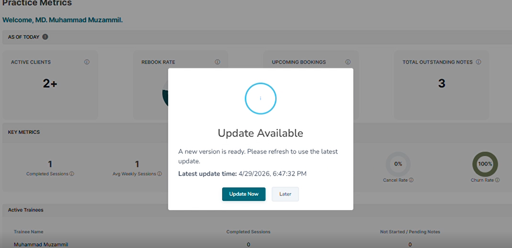
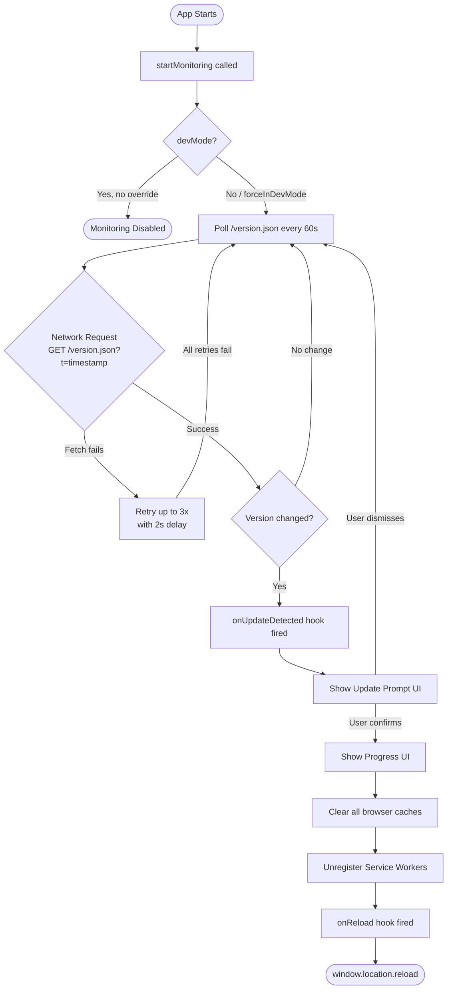
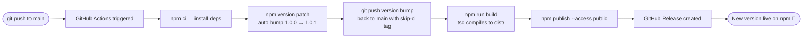
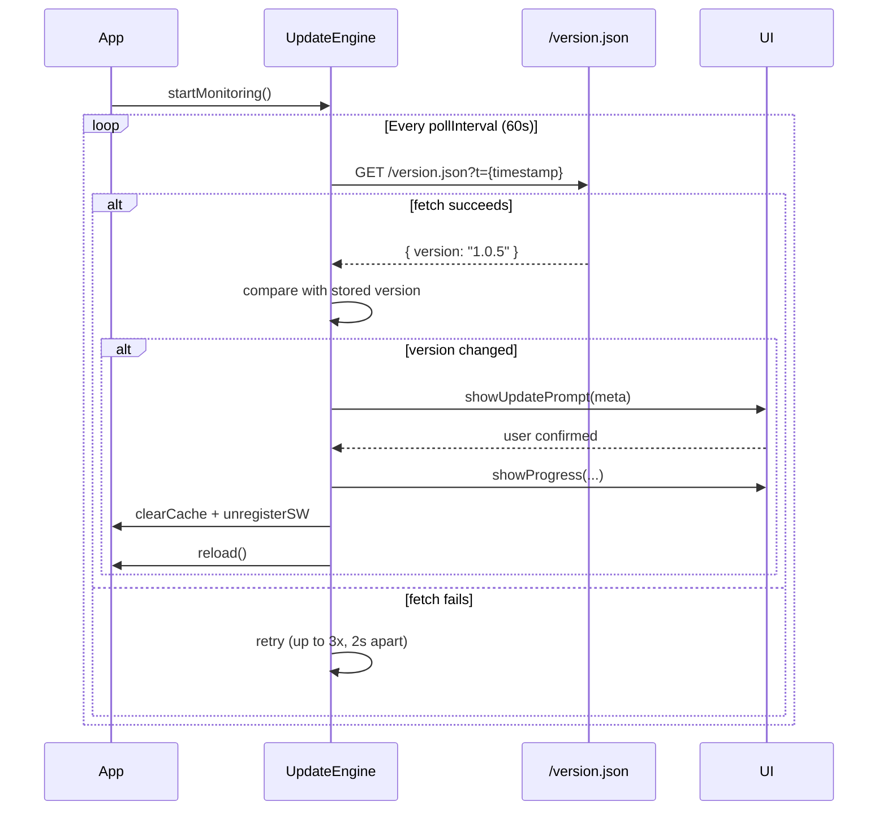

# @muzzamil7770/app-update-agent

[](https://www.npmjs.com/package/@muzzamil7770/app-update-agent)
[](https://www.npmjs.com/package/@muzzamil7770/app-update-agent)
[](LICENSE)
[](https://www.typescriptlang.org/)
[](https://angular.io/)
[](https://github.com/muzzamil7770/app-update-agent/actions)

> Detects app version changes, prompts users to update, clears cache, unregisters service workers, and reloads — with a pluggable UI and full Angular support.

```bash
npm i @muzzamil7770/app-update-agent
```

---

## Preview

### Update Prompt
> The dialog shown to the user when a new version is detected.



### Progress / Reload Screen
> The progress UI shown while cache is cleared and the app reloads.


---

## Video Demo

> Watch how the full update flow works — from version detection to reload.

[](docs/demo.mp4)

> 📌 **To add your own:** replace `docs/screenshots/update-prompt.png`, `docs/screenshots/update-progress.png`, and `docs/demo.mp4` with your actual files and commit them.

---

## How It Works

### Full Update Flow



---

### Build & Publish Pipeline



---

### Network Version Check Internals



---

## Installation

```bash
npm i @muzzamil7770/app-update-agent
```

With SweetAlert2 UI (default):

```bash
npm i @muzzamil7770/app-update-agent sweetalert2
```

---

## Quick Start (Angular)

```ts
// app.component.ts
import { AppUpdateService } from '@muzzamil7770/app-update-agent';

constructor(private appUpdate: AppUpdateService) {}

ngOnInit() {
  this.appUpdate.startMonitoring();
}
```

Zero config needed — defaults match the original behaviour exactly.

---

## Configuration

Configure once globally before `startMonitoring()` (e.g. in `main.ts`):

```ts
import { AppUpdateService } from '@muzzamil7770/app-update-agent';

AppUpdateService.configure({
  versionUrl:       '/version.json',  // default
  pollInterval:     60_000,           // ms, default
  ui:               'sweetalert',     // 'sweetalert' | 'custom' | 'none'
  devMode:          false,            // set true in dev builds
  forceInDevMode:   false,            // override devMode guard for testing
  retryAttempts:    3,                // fetch retries on failure
  retryDelay:       2000,             // ms between retries
  onUpdateDetected: (meta) => console.log('Update detected:', meta),
  onReload:         ()     => console.log('Reloading…'),
});
```

---

## Dev Mode Testing

When `devMode: true`, monitoring is disabled unless:

- URL contains `?appUpdateTest=1`
- `localStorage.app_update_test === '1'`

```js
// Browser console
window.simulateAppUpdate();
```

```ts
// Programmatic
await this.appUpdate.manualCheck();
```

---

## Custom UI

```ts
import { AbstractUpdateUI, VersionMeta } from '@muzzamil7770/app-update-agent';

class MyToastUI extends AbstractUpdateUI {
  showUpdatePrompt(meta: VersionMeta, onConfirm: () => void, onDismiss: (meta: VersionMeta) => void) {
    // show your toast/modal
  }
  showProgress(label: string, pct: number) { /* open progress modal */ }
  updateProgress(label: string, pct: number) { /* update progress bar */ }
}

AppUpdateService.setUI(new MyToastUI());
```

Set `ui: 'none'` to suppress all UI and handle `onUpdateDetected` yourself.

---

## Framework-Agnostic Core

```ts
import { UpdateEngine, SwalUpdateUI } from '@muzzamil7770/app-update-agent';

const engine = new UpdateEngine(
  { versionUrl: '/version.json', pollInterval: 30_000 },
  new SwalUpdateUI(),
);

engine.start();
engine.stop();
await engine.manualCheck();
```

---

## API Reference

### `AppUpdateService` (Angular)

| Method | Description |
|---|---|
| `static configure(config)` | Set global config before first use |
| `static setUI(ui)` | Inject a custom UI implementation |
| `startMonitoring()` | Begin polling + visibility listener |
| `manualCheck()` | Trigger an immediate version check |

### `UpdateEngine` (Core)

| Method | Description |
|---|---|
| `start()` | Begin polling |
| `stop()` | Stop polling and clear interval |
| `manualCheck()` | Trigger an immediate version check |

### `UpdateAgentConfig`

| Option | Type | Default | Description |
|---|---|---|---|
| `versionUrl` | `string` | `'/version.json'` | URL to fetch version from |
| `pollInterval` | `number` | `60000` | Polling interval in ms |
| `ui` | `'sweetalert' \| 'custom' \| 'none'` | `'sweetalert'` | UI mode |
| `devMode` | `boolean` | `false` | Disable monitoring in dev |
| `forceInDevMode` | `boolean` | `false` | Override devMode guard |
| `retryAttempts` | `number` | `3` | Fetch retry count |
| `retryDelay` | `number` | `2000` | Ms between retries |
| `onUpdateDetected` | `(meta) => void` | — | Hook fired on version change |
| `onReload` | `() => void` | — | Hook fired before reload |

---

## Links

- 📦 npm: https://www.npmjs.com/package/@muzzamil7770/app-update-agent
- 🐙 GitHub: https://github.com/muzzamil7770/app-update-agent
- 🐛 Issues: https://github.com/muzzamil7770/app-update-agent/issues
